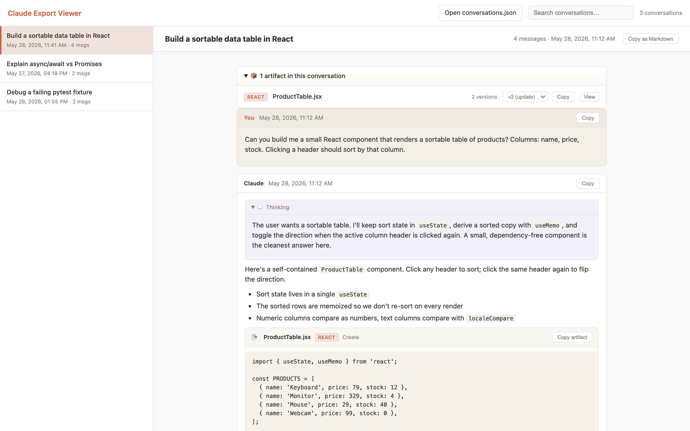

# Claude Export Viewer

A tiny, single-file web app for browsing your exported **Claude.ai** conversations — search them, read them with full formatting, expand Claude's thinking, and view artifacts (including every version) as first-class cards.

**Everything runs locally in your browser.** Your `conversations.json` is never uploaded anywhere — the app reads it directly on your machine.

👉 **Live app: [yanndebray.github.io/claude-history-2](https://yanndebray.github.io/claude-history-2/)**



## Features

- 🔍 **Search** conversations by title
- 💬 **Full message rendering** — markdown, code blocks, attachments
- 💭 **Collapsible thinking** blocks
- 🧩 **Artifact cards** with version history and an inline preview/view
- 📋 **Copy as Markdown** — a whole conversation or a single message
- 🔒 **100% local** — no server, no upload, no tracking

## How to use it

### 1. Export your data from Claude.ai

Claude lets you export all of your conversations as a downloadable archive:

1. Sign in at [claude.ai](https://claude.ai) (export is available on the web app and desktop, not on mobile).
2. Click your **initials** in the lower-left corner and choose **Settings**.
3. Go to the **Privacy** section and click **Export data**.
4. Claude emails you a download link (the link expires after 24 hours, and you must be signed in to use it). Download the `.zip` and unzip it.

You'll get a folder named something like `data-XXXXXXXX-…-batch-0000/` containing a `conversations.json` file — that's the one this app reads.

> 📚 Official help: [How can I export my Claude.ai data?](https://support.claude.com/en/articles/9450526-how-can-i-export-my-claude-ai-data)

### 2. Open it in the viewer

Go to the **[live app](https://yanndebray.github.io/claude-history-2/)** and either:

- Click **Open conversations.json** and pick the file from your unzipped export folder, **or**
- Drag-and-drop the `conversations.json` file (or the whole export folder) onto the page.

That's it — your conversations appear in the sidebar, newest first.

## Run it locally

It's a single static HTML file with no build step or dependencies:

```bash
git clone https://github.com/yanndebray/claude-history-2.git
cd claude-history-2

# open it directly…
open index.html

# …or serve it (any static server works)
python3 -m http.server 8000
# then visit http://localhost:8000
```

## Try it with sample data

Don't want to export your own data first? The repo ships a small synthetic export at [`sample/conversations.json`](sample/conversations.json) — open that file in the viewer to see how everything looks. It contains no real conversations.

## Regenerating the screenshot

The screenshot in this README is generated automatically from the sample data, so it stays in sync with the UI. It uses [Playwright](https://playwright.dev/) to load `index.html` in a headless browser, feed in `sample/conversations.json`, and capture the result.

```bash
npm install          # installs Playwright (once)
npm run screenshot   # writes screenshot.png from sample/conversations.json
```

- Recipe: [`scripts/screenshot.mjs`](scripts/screenshot.mjs)
- Sample data: [`sample/conversations.json`](sample/conversations.json) — edit it to change what the screenshot shows

## Privacy

This is a static page. There is no backend and no analytics. The `conversations.json` you open is parsed entirely in your browser and nothing leaves your device. The repository itself contains **no conversation data** — exports are gitignored.

## License

MIT
